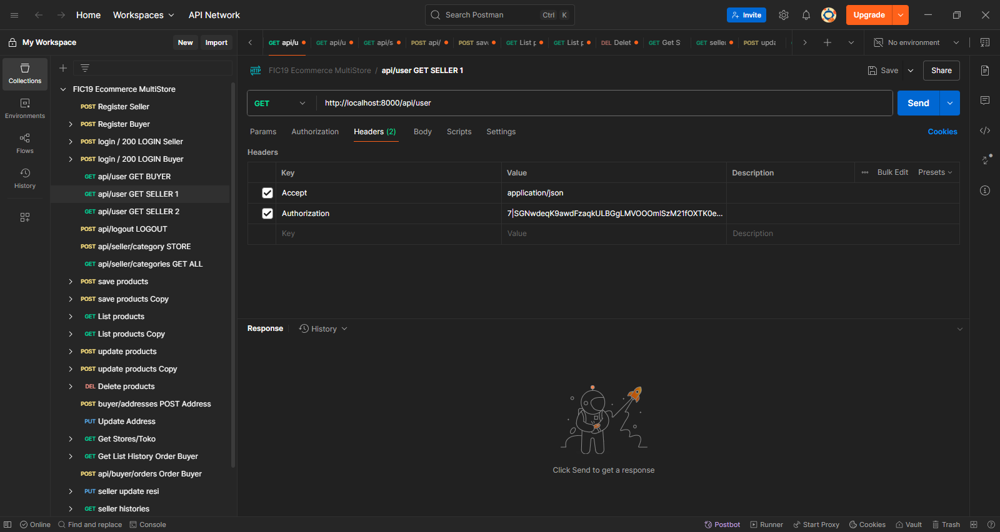

<p align="center"><a href="https://laravel.com" target="_blank"></a></p>

<p align="center">
<a href="https://github.com/laravel/framework/actions"></a>
<a href="https://packagist.org/packages/laravel/framework"></a>
<a href="https://packagist.org/packages/laravel/framework"></a>
<a href="https://packagist.org/packages/laravel/framework"></a>
</p>


# 🛒 Ecommerce MultiStore

Dokumentasi ini berisi koleksi pengujian API menggunakan Postman untuk proyek backend **Ecommerce MultiStore**. Proyek ini mensimulasikan sistem ecommerce dengan konsep multi-toko, di mana terdapat dua jenis pengguna utama yaitu **Seller (Penjual)** dan **Buyer (Pembeli)**.

## 📌 Fitur yang Diuji

### Autentikasi
- **Register Seller** - Mendaftarkan akun penjual baru dengan data lengkap dan upload foto profil.
- **Register Buyer** - Mendaftarkan akun pembeli dengan data dasar.
- **Login** - Autentikasi pengguna (seller dan buyer) untuk mendapatkan Bearer Token.
- **Logout** - Mengakhiri sesi login pengguna.

### User
- **GET User** - Mengambil data profil pengguna berdasarkan token autentikasi.

### Produk
- **Save Product** - Menambahkan produk baru oleh seller.
- **Update Product** - Memperbarui detail produk seller.
- **List Product** - Menampilkan daftar produk seller.
- **Upload Gambar Produk** - Mendukung upload file gambar via `form-data`.

### Kategori
- **Create Category** - Seller dapat menambahkan kategori produk.
- **List Categories** - Menampilkan semua kategori produk.

## 🔐 Autentikasi
Sebagian besar endpoint dilindungi dan memerlukan **Bearer Token**. Token didapat setelah proses login berhasil.

Contoh:
```
Authorization: Bearer <your_token>
```

## ⚙️ Teknologi & Tools
- **Postman**
- **JSON** & **Form-Data**
- **Laravel API Backend (Localhost:8000)**
- **PHP 8.3.15**

## 🧪 Tujuan
Koleksi ini digunakan untuk:
- Menjamin seluruh endpoint bekerja sesuai spesifikasi
- Melatih praktik API-first development
- Mendukung simulasi ecommerce berbasis Laravel

---

### 🚀 Screenshot Postman
Postman API



> Project ini merupakan bagian dari simulasi backend ecommerce dengan pendekatan REST API dan digunakan untuk mendukung pengembangan sistem ecommerce modern berbasis Laravel dan API-first architecture.

